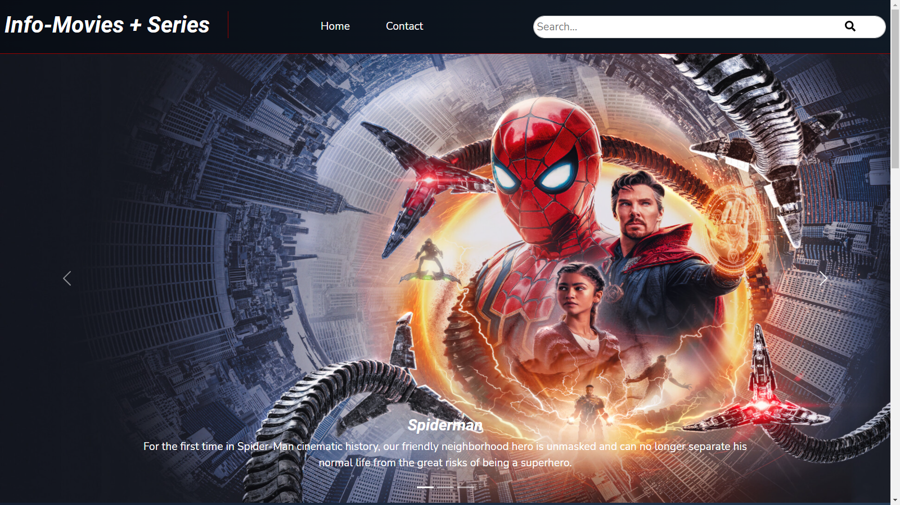
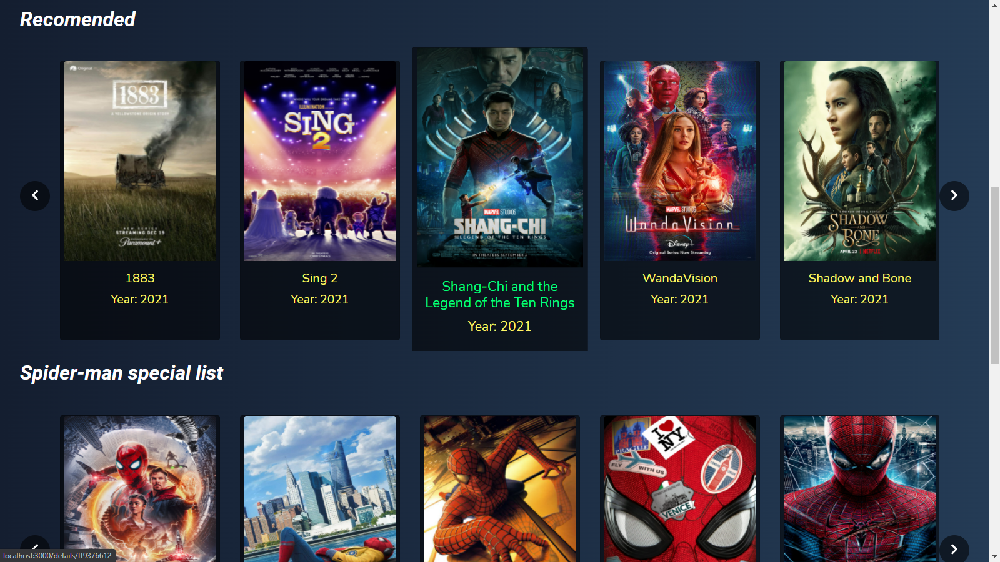
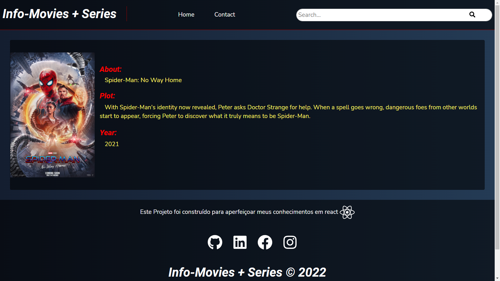
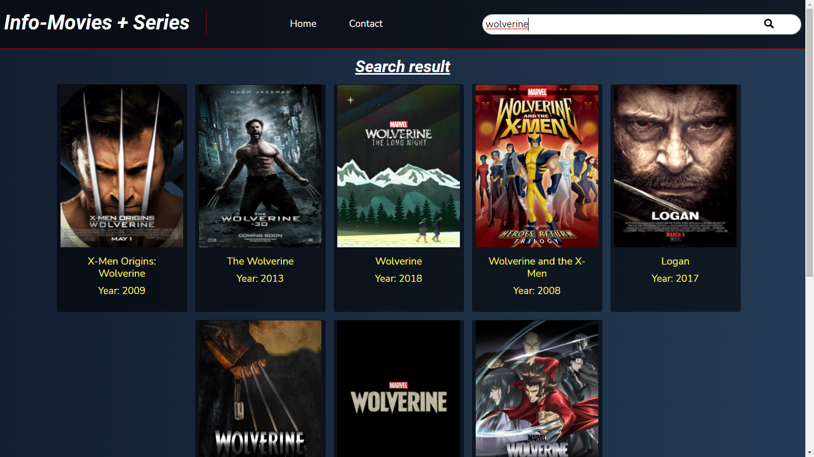

<h1 align="center">Info-Movies + Series</h1>

<p align="center">
  <a href="#-tecnology">Tecnology</a>&nbsp;&nbsp;&nbsp;|&nbsp;&nbsp;&nbsp;
  <a href="#-project">Project</a>&nbsp;&nbsp;&nbsp;|&nbsp;&nbsp;&nbsp;
  <a href="#-license">License</a>
</p>

<p align="center">
 

  
</p>

<br>

## 💻 Project

##### Projeto Front-End  

<p>Info-movies + series venho como um desafio para mostrar minha habilidades em trabalhar com next js um belíssimo framework do react utilizei saas e react-bootstrap para deixar um visual bem moderno e agrádavel aos olhos ,utilizei também a API IMDB para as informações de filmes e séries, ainda irei continuar a evoluir o projeto espero que gostem </P>


# Preview 🛰

<p align="center">
  
</p>
<p align="center">
  
</p>
<p align="center">
  
</p>
<p align="center">
  
</p>
<p align="center">
  
</p>


## 🚀 Technology

This project was developed with the following technologies:


<b>Frontend</b>
- [React]()
- [Next]()
- [Sass]()

## 🛠 Install

1. Clone o repositório:

   ```bash
   $ git clone https://github.com/edsnasc/Info-Movies-Series.git
   ```
2. Cadastre uma chave para utilizar a api
     
    ```bash
   https://rapidapi.com/apidojo/api/imdb8/
   ```
3. execute os comandos 

    ```bash
    $yarn install - instale as dependencias
    $yarn server - execute o servidor json
    $yarn dev - execute o app
   ```

## 📝 License

This project is under the MIT license. See the [LICENSE] file (LICENSE.md) for more details.

---

Created by Edson Nascimento 🚀/ [LinkedIn](https://www.linkedin.com/in/edson-nascimento-5783681aa/)